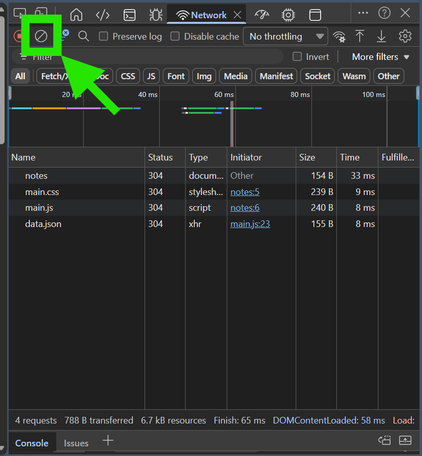

# Osa 0
## Web sovelluksen toimintaperiaatteet

Ennen tehtäviä, tutustu *esimerkki_mermaid_kaavio.md* -tiedostosta löytyvää kaaviota. Vertaa sitä selaimen keihittäjän työkalujen network-välilehdellä näkyviin tapahtumiin. Varmista, että ymmärrät kaaviota.

Tee tehtävät tästä kansiosta valmiiksi löytyviin tiedostoihin ja palauta ne githubiin tekemällä commitin (saat tehdä myös useita committeja). 

## Tehtävät:
### Tehtävä 0.1 uusi muistiinpano

Tehtävässä tehdään esimerkkiä vastaava kaavio, joka kuvaa, mitä tapahtuu tilanteessa, jossa käyttäjä luo uuden muistiinpanon ollessaan sivulla https://studies.cs.helsinki.fi/exampleapp/notes eli kirjoittaa tekstikenttään jotain ja painaa nappia tallenna.

1. Avaa https://studies.cs.helsinki.fi/exampleapp/notes ja sen jälkeen tyhjennä network-välilehden tapahtumalista. Saat tapahtumalistan tyhjennettyä painamalla kuvan mukaista painiketta:

   

2. Luo uusi muistiinpano ja sen jälkeen katso tarkkaan network-välilehdelle ilmestyviä tapahtumia. Kustakin tapahtumasta kannattaa tarkistaa header ja response -osiot.

3. Tee *0_1_uusi_muistiinpano.md* -tiedostoon mermaid-kaavio, jossa näkyy tämä tapahtumasarja. Kirjoita tarvittaessa palvelimella tai selaimessa tapahtuvat operaatiot sopivina kommentteina kaavion sekaan.

### Tehtävä 0.2 SPA
Tee kaavio tilanteesta, jossa käyttäjä menee selaimella osoitteeseen https://studies.cs.helsinki.fi/exampleapp/spa eli muistiinpanojen Single Page App-versioon

1. Avaa https://studies.cs.helsinki.fi/exampleapp/spa

2. Voit nyt tyhjentää kehittäjän työkalujen network-välilehden tapahtumalistan ja päivittää sivun. Näin varmistat, ettei network-välilehdellä näy ylimääräisiä tapahtumia.Kustakin tapahtumasta kannattaa tarkistaa header ja response -osiot.

3. Tee *0_2_SPA.md* -tiedostoon mermaid-kaavio, jossa näkyy tämä tapahtumasarja. Kirjoita tarvittaessa palvelimella tai selaimessa tapahtuvat operaatiot sopivina kommentteina kaavion sekaan.

### Tehtävä 0.3 uusi muistiinpano - SPA
Tee kaavio tilanteesta, jossa käyttäjä luo uuden muistiinpanon single page ‑versiossa.

1. Avaa https://studies.cs.helsinki.fi/exampleapp/spa ja sen jälkeen tyhjennä network-välilehden tapahtumalista.

2. Luo uusi muistiinpano ja sen jälkeen katso tarkkaan network-välilehdelle ilmestyviä tapahtumia. Kustakin tapahtumasta kannattaa tarkistaa header ja response -osiot.

3. Tee *0_3_uusi_muistiinpano_SPA.md* -tiedostoon mermaid-kaavio, jossa näkyy tämä tapahtumasarja. Kirjoita tarvittaessa palvelimella tai selaimessa tapahtuvat operaatiot sopivina kommentteina kaavion sekaan.