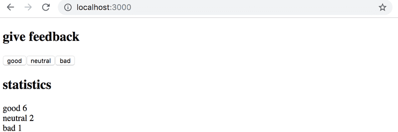
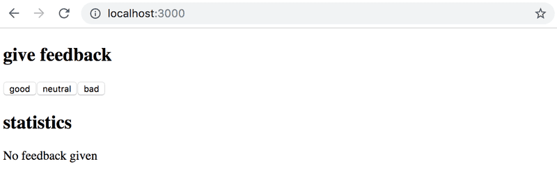
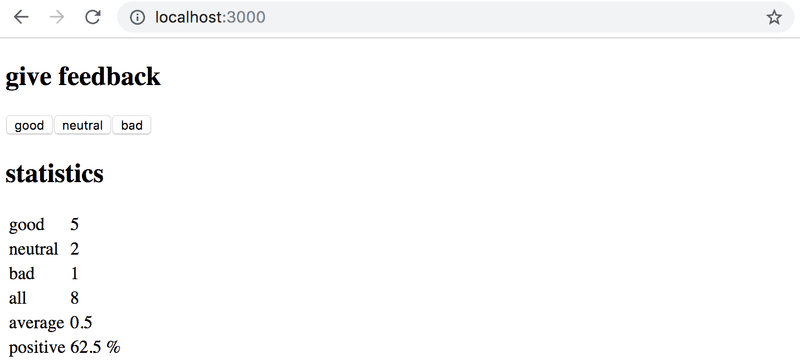
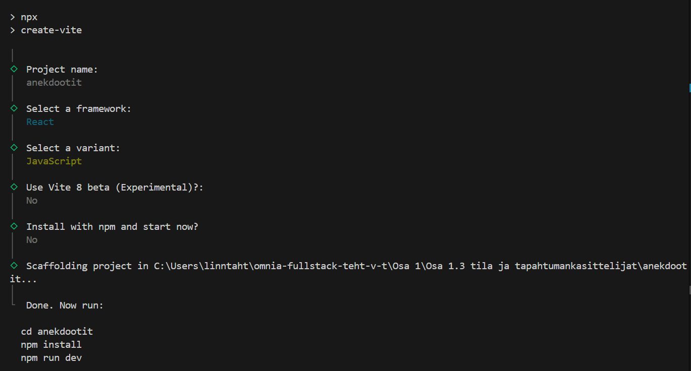
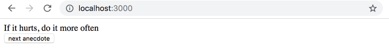
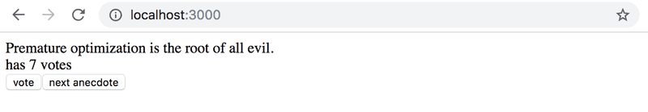
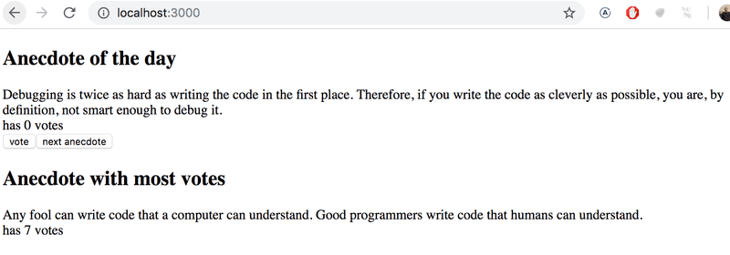

# Osa 1.3
## Tila ja tapahtumankäsittelijät
Tässä osassa tutustutaan käsitteisiin komponentin tila sekä tapahtumankäsittelijä. Kansiosta löytyy esimerkkisovellus *counterEsimerkki*. Aloita tutustumalla esimerkkisovellukseen. Voit jälleen muokata koodia ja katsoa, mitä muutoksia ne aiheuttavat selaimessa. Varmista, että ymmärrät seuraavat käsitteet ja tiedät, miten niitä käytetään: *komponentin tila*, *useState-hook*, *tapahtumankäsittelijä*.

## Tehtävät:


### Tehtävä 1.7 Unicafe osa 1
Tehtävässä tehdään alla olevan kuvan mukainen sovellus.
    

Sovelluksessa on kolme nappia, joilla voi antaa palautetta. Jokainen nappi päivittää erillistä tilaa, joiden arvot renderöidään "Statistics" osioon. Tehtäväpohja löytyy kansiosta unicafe.

1. Aloita lisäämällä otsikot "give feedback" ja "Statistics" *h1*-elementteinä
2. Aloita lisäämällä yksi nappi ja sille tapahtuman käsittelijä. Tarvittavat tilat (state) on jo määäritelty *App*-komponentin alussa.
    - Vot käyttää loggausta tai lisätä samantien tilan arvon renderöinnin "Statistics"-otsikon alle
3. Lisää myös kaksi muuta nappia ja niille tapahtumankäsittelijät. Voit tehdä jokaiselle napille oman tapahtumankäsittelijäfunktion. 
    - Tarkista, että jokainen nappi päivittää eri tilaa. (good nappi päivittää good-tilaa jne.)
4. Lisää "Statistics"-otsikon alle tilojen arvojen, eli palaute tulosten, renderöinti kuvan mallin mukaisesti. Voit käyttää *p*-elementtejä.
5. Varmista, että sovellus toimii eikä selaimen konsolissa näy virheitä. Kun painat nappeja, täytyy numeroiden päivittyä "Statistics"-osiossa. Kun päivität sivun, numerot nollautuvat.
6. Palauta tehtävä tekemällä commit. Lisää commit-viestiin tehtävän numero, eli 1.7

### Tehtävä 1.8 Unicafe osa 2
Jatketaan samaa unicafe sovellusta. Nyt sovellukseen lisätään tilastoarvoja palautteesta:
    

1. Lisää "Statistics"-otsikon alle vastausten keskiarvo. Keskiarvo lasketaan siten, että "good" äänet vastaavat lukua 1, "neutral" äänet lukua 0 ja "bad" äänet lukua -1.
    - Keskiarvolasketaa laskemalla yhteen kaikkien lukujen arvot ja jakamalla saatu summa lukujen lukumäärällä. Esimerkiksi kahden "good" äänen, yhden "neutral" äänen ja yhden "bad" äänen keskiarvo lasketaan (2*1+1*0+1*(-1))/4
    - Tallenna keskiarvo omaan muuttujaan, ja renderöi tämän muuttujan arvo
2. Lisää "Statistics"-otsikon alle luku, joka kertoo, kuinka monta prosenttia kaikista vastauksista on positiivisia
    - Positiivisten vastausten osuus lasketaan jakamalla "good" vastausten lukumäärä kaikkien vastausten lukumäärällä ja kertomalla saatu luku sadalla.
    - Tallenna myös tämä luku omaan muuttujaan.
3. Tarkista, että uudet tilastoarvot toimivat oikein ja päivittyvät, kun klikkailet nappeja. Tarkista myös, ettei selaimen konsolissa näy virheitä. Palauta tehtävä tekemällä commit. Lisää commit-viestiin tehtävän numero, eli 1.8


### Tehtävä 1.9 Unicafe osa 3
Seuraavaksi refaktoroidaan unicafe-sovellusta, eli muutetaan koodia ilman, että toiminnallisuus muuttuu. Teemme uuden komponentin, johon siirretään osa *App*-komponentin koodista.

1. Lisää sovellukseen uusi komponentti *Statistics* seuraavalla tavalla:
    1. Komponentin määrittely tulee tehdä *App*-komponentin yläpuolelle
    2. Uusi komponentti *Statistics* ottaa kolme propsia: good, neutral ja bad. Näille propseille annetaan arvoiksi vastaavien tilojen arvo. Uusi komponentti renderöidään *App*-komponentissa.
        - Huom! Varsinainen tila pysyy *App*-komponentissa, ainoastaan niiden arvot annetaan propsina *Statistics*-komponentille
    3. Siirrä *Statistics*-komponenttiin keskiarvon ja positiivisten vastausten osuuden laskeminen
    4. *Statistics*-komponentin tulee renderöidä otsikko "Statistics", sekä kaikki tämän otsikon alla olevat tiedot.
2. Refaktoroinnin jälkeen sovelluskoodisi tulee näyttää tältä:
    ```jsx
    const Statistics = ({ good, neutral, bad }) => {
        // kirjoita tähän koodi uudelle Statistics-komponentille
    }

    const App = () => {
        // pidä tilojen määrittely App-komponentissa
        const [good, setGood] = useState(0)
        const [neutral, setNeutral] = useState(0)
        const [bad, setBad] = useState(0)

        return (
            <div>
                <h1>Give feedback</h1>
                // ...
                <h1>Statistics</h1>
                <Statistics ... />
            </div>
        )
    }
    ```
3. Kun olet refaktoroinut sovelluksesi ja tarkistanut, että se toimii eikä selaimen konsolissa näy virheitä, palauta tehtävä tekemällä commit. Lisää commit-viestiin tehtävän numero, eli 1.9

### Tehtävä 1.10 Unicafe osa 4
Jatketaan edelleen Unicafe-sovellusta. Nyt "Satistics" osion renderöintiä muutetaan siten, että tilastoarvoja ei renderöitä, jos yhtäkään palautetta ei ole vielä annettu.

Kun palautetta ei ole vielä annettu, sovelluksen tulee näyttää tältä:
     

1. Muuta *Statistics*-komponenttia siten, että tilastoarvot renderöidään ehdollisesti. Jos palautetta ei ole annettu, näytetään vain teksti "No feedback given".
2. Tarkista, että sovellus toimii: jos päivität sivun, sivulla näkyy "No feedback given". Kun painat nappeja, tilastoarvot tulevat näkyviin. Tarkista, ettei selaimen konsolissa näy virheitä.
3. Palauta tehtävä tekemällä commit. Lisää commit-viestiin tehtävän numero, eli 1.10


### Tehtävä 1.11 Unicafe osa 5
Tässä tehtävässä jälleen refaktoroidaan unicafe-sovellusta. Nyt refaktoroidaan *Statistics*-komponenttia:

1. Lisää uusi komponentti "StatisticLine*, joka ottaa kaksi propsia: text ja value
    - text-propsin arvoksi annetaan rivillä näkyvä teksti (esim. "good", "neutral", "average")
    - value-propsin arvoksi annetaan rivillä näkyvä lukuarvo
2. Renderöi jokainen tilastorivi *Statistics*-komponentissa käyttäen uutta *StatisticLine* komponenttia. Pidä kaikki laskenta *Statistics*-komponentissa
3. Tarkista, että sovellus toimii eikä selaimen konsolissa näy virheitä. *Statistics*-komponentin tulee nyt näyttää tältä:
    ```jsx
    const Statistics = (props) => {
        /// ...
        return(
            <div>
            <StatisticLine text="good" value={...} />
            <StatisticLine text="neutral" value={...} />
            <StatisticLine text="bad" value={...} />
            // ...
            </div>
        )
    }
    ```
4. Palauta tehtävä tekemällä commit. Lisää commit-viestiin tehtävän numero, eli 1.11

## Lisätehtävät

### Tehtävä 1.12 Unicafe osa 6
Jatketaan sovelluksen refaktorointia tekemällä myös napeille oma komponentti *Button*.

1. Lisää uusi komponentti *Button*, joka saa propsit text ja onClick. Komponentti renderöi napin,  jolla on propsien mukainen teksti ja tapahtumankäsittelijä.
2. Refaktoroi *App*-komponenttia siten, että napit renderöidään käyttäen uutta *Button*-komponenttia.
3. Tarkista, että sovellus toimii eikä selaimen konsolissa näy virheitä. Palauta tehtävä tekemällä commit. Lisää commit-viestiin tehtävän numero, eli 1.12

### Tehtävä 1.13 Unicafe osa 7
Muuta "Statistics" osion toteutusta siten, että muutat sen käyttämään [HTML taulukkoa](https://developer.mozilla.org/en-US/docs/Learn_web_development/Core/Structuring_content/HTML_table_basics). Muutoksen jälkeen sovelluksen tulee näyttää suurinpirtein tältä:
    

Tarkkaile koko ajan selaimen konsolia ja tarvittaessa googlaa näkemäsi virheet.

Kun sovellus toimii, eikä selaimen konsolissa näy virheitä, palauta tehtävä tekemällä commit. Lisää commit-viestiin tehtävän numero, eli 1.13

### Tehtävä 1.14 Anekdootit osa 1
Tässä tehtävässä aloitetaan uusi sovellus "Anekdootit". Tällä kertaa sovelluksen tiedostoja ei ole luotu valmiiksi, vaan pääset harjoittelemaan React-sovelluksen luontia itse vitellä. Alla on ensin ohjeet uuden projektin luontiin ja sen jälkeen ohjeet varsinaiseen tehtävään.

#### Uuden React-projektin luonti:
1. Sammuta ensin edellinen sovellus klikkaamalla terminaalia ja käyttämällä näppäinyhdistelmää ctrl+C
2. Navigoi terminaalissa kansioon "Osa 1.3 tila ja tapahtumankasittelijat"
    - Todennäköisesti sinun tarvitsee vain suorittaa komento **cd ..**
3. Kun olet navigoinut oikeaan tiedostosijaintiin, suorita komento **npm create vite@latest**
4. Vastaa kysymyksiin alla olevan kuvan mukaisesti:
    
5. Kun projekti on luotu, voit poistaa sieltä kansion *assets* sekä tiedostot *App.css* ja *index.css*. Tämän jälkeen, poista *main.jsx* tiedostosta kaikki koodi ja kopioi tilalle alla oleva:
    ```jsx
        import ReactDOM from 'react-dom/client'
        import App from './App'

        ReactDOM.createRoot(document.getElementById('root')).render(<App />)
    ```
    
6. Kopioi *App.jsx*-tiedostoon vastaavasti tämä:
    ```jsx
        import { useState } from 'react'

        const App = () => {
            const anecdotes = [
                'If it hurts, do it more often.',
                'Adding manpower to a late software project makes it later!',
                'The first 90 percent of the code accounts for the first 90 percent of the development time...The remaining 10 percent of the code accounts for the other 90 percent of the development time.',
                'Any fool can write code that a computer can understand. Good programmers write code that humans can understand.',
                'Premature optimization is the root of all evil.',
                'Debugging is twice as hard as writing the code in the first place. Therefore, if you write the code as cleverly as possible, you are, by definition, not smart enough to debug it.',
                'Programming without an extremely heavy use of console.log is same as if a doctor would refuse to use x-rays or blood tests when dianosing patients.',
                'The only way to go fast, is to go well.'
            ]
            
            const [selected, setSelected] = useState(0)

            return (
                <div>
                {anecdotes[selected]}
                </div>
            )
        }

        export default App
    ```
7. Voit nyt käynnistää sovelluksen suorittamalla seuraavat komennot:
    1. **cd anekdootit**
    2. **npm i**
    3. **npm run dev**

#### Varsinainen tehtävä: 
Tehtävänä on lisätä sovellukseen nappi, jota painamalla sovellus näyttää uuden satunnaisesti valitun anekdootin. Sovelluksen tulee näyttää tältä:
    

1. Lisää sovellukseen nappi, jossa lukee "next anectdote", voit aluksi laittaa tapahtumankäsittelijäksi tyhjän funktion **()=>{}**. Muuta tämän paikalle myöhemmin varsinainen tapahtumankäsittelijä.
2. Tee sitten tapahtumankäsittelijä napille. Tee funktio, joka asettaa *selected*-tilan arvoksi indeksi satunnaiselle anekdootille.
    - Saat tehtyä satunnaisen kokonaisluvun välillä [0,max] näin:
        ```jsx
            Math.floor(Math.random() * (max + 1))
        ```
    - Mieti tarkkaan, mikä luvun max täytyy olla. Vinkki: taulukon indeksit alkavat nollasta
3. Tarkista, että sovellus toimii, eikä selaimen konsolissa näy virheitä. Kokeile klikata nappia useita kertoja ja katso, että anekdootti vaihtuu oikein, eikä konsolissa näy virheitä.
    - Voit käyttää console.log tapahtumankäsittelijässä loggaamaan, mitä lukuja satunnaislukugeneraattori antaa.
4. Palauta tehtävä tekemällä commit. Lisää commit-viestiin tehtävän numero, eli 1.14

### Tehtävä 1.15 Anekdootit osa 2
Nyt anekdootit-sovellukseen lisätään mahdollisuus äänestää anekdootteja:
    

1. Lisää komponenttiin uusi tila, johon tallennat äänet esimerkiksi oliona (object) tai taulukkona. Tilan nimi voi olla esimerkiksi "votes". Alusta tila siten, että jokaisella anekdootilla on nolla ääntä.
    - Jos tallennat äänet oliona, olion avaimet (keys) ovat anekdoottien indeksit, ja arvot (values) äänten määrä. Saat alustettua olion, jossa on avaimina luvut 0-max ja arvoina nollat näin:
        ```jsx
        Object.fromEntries(
            Array.from({ length: max + 1 }, (_, i) => [i, 0])
        );
        // tämä luo objektin, joka näyttää tältä: {0:0, 1: 0, ... max: 0}
        ```
    - Jos tallennat äänet taulukkona, sisältää taulukko vain äänten määrät siten, että anekdootin ääni löytyy sen omaa indeksiä vastaavalta paikalta taulukosta. Saat alustettua n-pituisen taulukon nollia näin:
        ```jsx
        new Array(n).fill(0)

        // tämä luo taulukon, joka näyttää tältä: [0, 0, ... 0]
        ```
2. Muuta komponenttia siten, että renderöit näkyvissä olevan anekdootin äänten määrän (katso aiempi kuva)
3. Tee nyt funktio, jota käytetään äänestysnapin tapahtumankäsittelijänä. Funktion nimi voi olla esimerkiksi "voteAnecdote". Funktion tulee päivittää "votes"-tilaa siten, että *selected*-tilaan tallenetun indeksin mukaista arvoa kasvatetaan yhdellä.
    - Huom! Et voi päivittää oliota tai taulukkoa suoraan, vaan sinun täytyy ensin tehdä kopio, sitten tehdä kopioon halutut muutokset, ja lopuksi muuttaa tilan arvoksi tämä kopio:
        ```jsx
        // Oliosta tehdään kopioi ja päivitetään näin:
        const votes = { 0: 1, 1: 3, 2: 4, 3: 2 }

        const copy = { ...votes }
        // kasvatetaan olion kentän 2 arvoa yhdellä
        copy[2] += 1 


        // Taulukosta tehdään kopio ja päivitetään näin:
        const votes = [1, 4, 6, 3]

        const copy = [...votes]
        // kasvatetaan taulukon paikan 2 arvoa yhdellä
        copy[2] += 1    
        ```
4. Lisää nyt vielä äänestys nappi, jota painamalla sillä hetkellä näkyvissa olevalle anekdootille annetaan yksi ääni lisää.
5. Tarkista, että sovellus toimii ja selaimen konsolissa ei näy virheitä. Kannattaa painella nappeja useita kertoja eri järjestyksessä, ja varmistaa, että ne todella toimivat oikein.
6. Palauta tehtävä tekemällä commit. Lisää commit-viestiin tehtävän numero, eli 1.15

### Tehtävä 1.16 Anekdootit osa 3
Viimeisessä tehtävässä anekdootit sovellusta päivitetään vielä siten, että sivun alaosassa näkyy eniten ääniä saanut anekdootti:
    

1. Muuta sovellusta siten, että sivulla näkyy eniten ääniä saanut anekdootti kuvan mukaisesti. Jos monella anekdootilla on sama äänimäärä, riittää, että niistä näytetään yksi.
    - Käytä googlea tai tekoälyä selvittääksesi, miten saat selville eniten ääniä saaneen anekdootin indeksin
2. Tarkista, että sovellus toimii ja erityisesti, että eniten ääniä saanut anekdootti päivittyy, kun annat lisää ääniä. Palauta tehtävä tekemällä commit. Lisää commit-viestiin tehtävän numero, eli 1.16