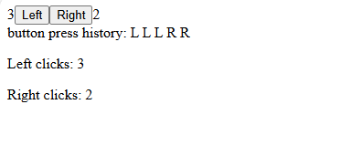

# Osa 1.4
## Debuggaus

## Tehtävät

### Tehtävä 1.17

Tavoitteena on korjata annettua koodia niin, koodi toimii ja sovellus näyttää tältä:
    

Konsolissa ei saa näkyä virheitä!

1. Käynnistä projekti nimeltä debug ja avaa se selaimessa

2. Korjaa *App.jsx*-tiedoston koodi niin, että se toimii eikä selaimen konsolissa näy virheitä. Koodista löytyy yhteensä 4 virhettä. Virheistä 3 estää ohjelmaa toimimasta, ja yksi on huono tapa, joka voi aiheuttaa ongelmia monimutkaisemmissa ohjelmissa
    - vinkki: älä määrittele komponentteja toisen komponentin sisällä!
    - virheiden korjaamiseen voi olla useita eri tapoja, kaikki järkevät tavat kelpaavat
4. Palauta tehtävä tekemällä commit. Lisää commit-viestiin tehtävän numero, eli 1.17
