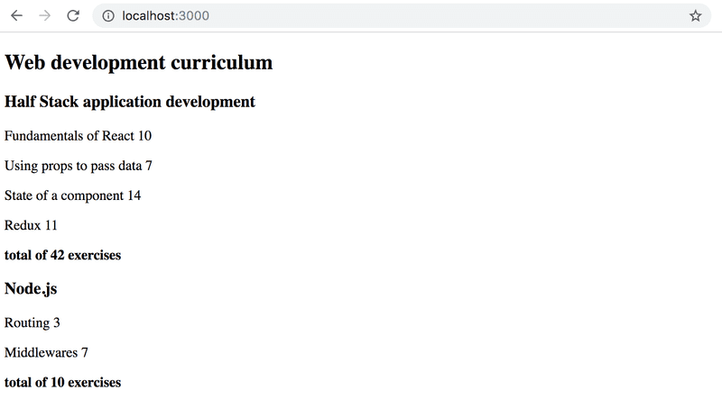

# Osa 2.2
## Taulukkomenetelmät
Tässä osassa tutustutaan taulukkomenetelmiin. Aloita tutustumalla esimerkkisovellukseen *taulukkomenetelmaesimerkki*. Varmista, että ymmärrät seuraavat käsitteet ja tiedät, miten niitä käytetään: *taulukkomenetelmä*, *map-metodi*, *reduce-metodi*. Kannattaa tutustua myös JavaScript taulukkomenetelmien dokumentaatioon googlen avulla.


## Tehtävät

### Tehtävä lisää JavaScriptia
1. Kansiosta *JavaScriptRakenteet* löytyy JavaScript-tiedosto, jossa on 6 pientä tehtävää. Tee tiedoston tehtävät kommenttien ohjeiden mukaisesti.
2. Palauta tehtävä tekemällä commit. Lisää commit-viestiin tehtävän numero, eli 

## Esivalmistelut loppuihin tehtäviin
Lopuissa tämän osan tehtävissä jatketaan ensimmäisen osan kurssitiedot-projektia.

Avaa osan 1.1 kurssitiedot-projektin tiedosto *App.jsx* ja kopioi sen koodi tämän osan kurssitiedot-projektin *App.jsx*-tiedostoon


### Tehtävä kurssitiedot osa 6

1. Kommentoi aikaisempi *App*-komponentti (älä poista sitä vielä!) ja korvaa aikaisempi se alla olevalla koodilla:
    ```jsx
    const App = () => {
        const course = {
            name: 'Half Stack application development',
            id: 1,
            parts: [
            {
                name: 'Fundamentals of React',
                exercises: 10,
                id: 1
            },
            {
                name: 'Using props to pass data',
                exercises: 7,
                id: 2
            },
            {
                name: 'State of a component',
                exercises: 14,
                id: 3
            }
            ]
        }

        return (
            <div>
            <Course course={course} />
            </div>
        )
    }
    ```
2. Lisää uusi komponentti **Course**, joka renderöi komponentit **Header** ja **Content**.
    - **Total**-komponenttia ei tarvitse renderöidä tässä tehtävässä. Älä kuitenkaan poista komponenttia.
3. Muuta **Content**-komponenttia siten, että se toimii, vaikka lisäät tai poistat kurssista osia. Käytä siis *map*-metodia osien renderöintiin. 
4. Tarkista, että sovellus toimii, eikä konsolissa näy virheitä. Voit poistaa vanhan kommentoidun version *App*-komponentista. Palauta tehtävä tekemällä commit. Lisää commit-viestiin tehtävän numero, eli 

### Tehtävä kurssitiedot osa 7
1. Lisää **Course**-komponenttiin **Total**-komponentin renderöinti
2. Muuta **Total**-komponenttia niin, että tehtävien yhteenlaskettumäärä lasketaan oikein, vaikka lisäät tai poistat osia kurssista. Käytä *reduce*-metodia
    - Kannattaa käyttää console.log apuna hahmottamaan, miten *reduce*-metodi toimii:
        ```jsx
        const total = parts.reduce( (s, p) => {
            console.log('what is happening', s, p)
            return //tähän tulee jokin laskutoimitus 
        })
        ```
3. Tarkista, että sovellus toimii, eikä konsolissa näy virheitä. Palauta tehtävä tekemällä commit. Lisää commit-viestiin tehtävän numero, eli 

### Tehtävä kurssitiedot osa 8
Sovellusta muutetaan nyt niin, että kursseja voi olla useita. Sovelluksen tulee näyttää esimerkiksi tältä:
    

1. Korvaa *App*-komponentin alussa oleva muuttujan määrittely alla olevalla määrittelyllä:
    ```jsx
     const courses = [
        {
            name: 'Half Stack application development',
            id: 1,
            parts: [
                {
                name: 'Fundamentals of React',
                exercises: 10,
                id: 1
                },
                {
                name: 'Using props to pass data',
                exercises: 7,
                id: 2
                },
                {
                name: 'State of a component',
                exercises: 14,
                id: 3
                },
                {
                name: 'Redux',
                exercises: 11,
                id: 4
                }
            ]
        }, 
        {
            name: 'Node.js',
            id: 2,
            parts: [
                {
                name: 'Routing',
                exercises: 3,
                id: 1
                },
                {
                name: 'Middlewares',
                exercises: 7,
                id: 2
                }
            ]
        }
    ]
    ```
2. Korjaa nyt sovellus toimivaksi niin, että se toimii, vaikka kursseja on useita. 
    - Käytä *map*-metodia siihen, että renderöit jokaiselle *courses*-muuttujan taulukossa olevalle kurssi-oliolle oman *Course*-komponentin.
3. Lisää kurssien tietojen yläpuolelle *h1*-elementti, joka renderöi tekstin "Web development curriculum"
4. Tarkista, että sovellus toimii, eikä konsolissa näy virheitä. Palauta tehtävä tekemällä commit. Lisää commit-viestiin tehtävän numero, eli 

### Tehtävä kurssitiedot osa 9
Nyt koko sovellus on samassa *App.jsx*-tiedostossa. Tämä on epäkäytännöllistä, kun komponentteja on paljon tai ne ovat isoja.
1. Lisää kurssitiedot-projektin *src*-kansioon uusi kansio *components*
2. Lisää *components*-kansioon uusi tiedosto *Course.jsx*
3. Siirrä *App.jsx*-tiedostosta kaikki *Course*-komponentin, sekä sen alikomponenttien koodi uuteen *Course.jsx*-tiedostoon.
    - *App.jsx* tiedostoon pitäisi jäädä vain *App*-komponentin koodi
4. Exportaa *Course*-komponentti uudesta tiedostosta lisäämällä tiedoston loppuun **export default Course**
5. Importaa *Course*-komponentti *App.jsx*-tiedostossa lisäämällä tiedoston alkuun *import Course from './components/Course'*
6. Tarkista, että sovellus toimii, eikä konsolissa näy virheitä. Palauta tehtävä tekemällä commit. Lisää commit-viestiin tehtävän numero, eli 
