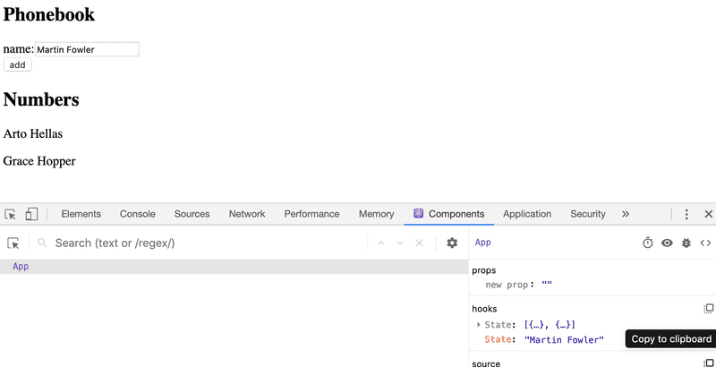
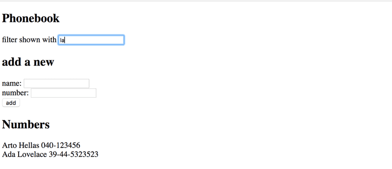

# Osa 2.3
## Lomakkeet
Tässä osassa opetellaan html-lomakkeiden käyttöä ja jatketaan javaScript-rakenteiden harjoittelua. Tutustu *notesesimerkki*-projektiin. Varmista, että ymmärrät seuraavat käsitteet ja tiedät, miten niitä käytetään: *lomake eli form*, *input-kenttä*, *input-kentän onChange-attribuutti*, *lomakkeen tapahtumankäsittelijä*.

## Tehtävät
Kaikki tämän osan tehtävät ovat samaa puhelinluettelo-projektia. Valmis pohja löytyy kansiosta puhelinluettelo.

### Tehtävä puhelinluettelo osa 1

1. Lisää sovelluksen lomakkeeseen kenttä, jolla käyttäjä voi lisätä uusia nimiä puhelinluetteloon
    - Huomaa, että persons-tila sisältää olioista muodostuvan taulukon. Uusi nimi pitää siis myös lisätä oliona.
2. Muuta sovellusta siten, että se renderöi kaikki puhelinluetteloon tallennetut henkilöt "Numbers"-otiskon alle
    - Käytä map-metodia! Voit käyttää key-arvona henkilöiden nimiä
3. Testaa, että sovellus toimii ja että se näyttää alla olevan kuvan mukaiselta

    
4. Kun sovellus toimii, eikä konsolissa näy virheitä, palauta tehtävä tekemällä commit. Lisää commit-viestiin tehtävän numero, eli 

### Tehtävä puhelinluettelo osa 2

1. Lisää *addPerson*-tapahtumankäsittelijään virheiden käsittely: jos käyttäjä yrittää lisätä henkilöä, joka löytyy jo puhelinluettelosta, lisäystä ei tehdä.
    - Vinkki: käytä find-metodia
2. Lisää virheidenkäsittelyyn virheviesti. Kun käyttäjä yrittää lisätä henkilön, joka on jo lisätty, näytä virheviesti "_nimi_ is already added to phonebook". Käytä [alert](https://developer.mozilla.org/en-US/docs/Web/API/Window/alert) komentoa.
    - Vinkki: voit käyttää virheviestissä "template stringiä" eli
        ```js 
        `${newName} is already added to phonebook`
        ```
3. Testaa, että sovellus toimii ja varmista, ettei konsolissa näy virheitä. Palauta tehtävä tekemällä commit. Lisää commit-viestiin tehtävän numero, eli

### Tehtävä puhelinluettelo osa 3
Tässä tehtävässä lisätään sovellukseen mahdollisuus lisätä puhelinluetteloon myös puhelinnumerot.

1. Lisää sovelluksen lomakkeeseen uusi input-elementti, jolla käyttäjä voi antaa puhelinnumeron. Lisää puhelinnumerolle myös oma tila ja tapahtumankäsittelijä.

2. Muuta *addPerson*-tapahtumankäsittelijää siten, että uusille person-olioille lisätään nimenlisäksi myös puhelinnumero.

3. Muuta puhelinluettelon tietojen renderöintiä siten, että sovelluksessa näkyy nimen lisäksi myös puhelinnumero.

4. Testaa, että sovellus toimii ja varmista, ettei konsolissa näy virheitä. Palauta tehtävä tekemällä commit. Lisää commit-viestiin tehtävän numero, eli

### Tehtävä puhelinluettelo osa 4

Tässä tehtävässä lisätään sovellukseen mahdollisuus filtteröidä listassa näkyviä henkilöitä nimen avulla. Sovelluksen tulee lopussa näyttää tältä:
    

1. Lisää sovelluksen yläosaan input-elementti, jolla käyttäjä voi filtteröidä henkilölistaa. Lisää inputille myös tila ja tapahtumankäsittelijät.
    - Huom! tätä input-elementtiä *ei* tule laittaa lomakkeen sisälle.
2. Muuta puhelinluettelotietojen renderöintiä siten, että listassa näkyvät vain filtterin mukaiset henkilöt:
    - Jos filtteri-kenttä on tyhjä, näytetään kaikki henkilöt
    - Jos filtteri-kentässä on tekstiä, näytetään ne, joiden nimestä löytyy sama teksti.
    - Käytä filter-metodia!
4. Testaa, että sovellus toimii ja varmista, ettei konsolissa näy virheitä. Palauta tehtävä tekemällä commit. Lisää commit-viestiin tehtävän numero, eli
    - Testausta varten voit alustaa puhelinluettelon tilan näin:
        ```js
         const [persons, setPersons] = useState([
            { name: 'Arto Hellas', number: '040-123456' },
            { name: 'Ada Lovelace', number: '39-44-5323523' },
            { name: 'Dan Abramov', number: '12-43-234345' },
            { name: 'Mary Poppendieck', number: '39-23-6423122' }
        ])
        ```

### Tehtävä puhelinluettelo osa 5
Tässä tehtävässä refaktoroidaan puhelinluettelo-sovellusta. Tarkoitus on jakaa sovellus pienempiin komponentteihin. Voit pitää kaikki komponentit samassa *App.jsx*-tiedostossa.

1. Erota sovelluksesta ainakin 3 uutta komponenttia. Pidä kaikki tapahtumankäsittelijät ja tilat edelleen **App**-komponentissa. Kolme uutta komponenttia voivat olla esimerkiksi:
    -**Filter**: komponentti sisältää input-elementin filtteröinnille. 
    -**PersonForm**: komponentti sisältää lomakkeen henkilöiden lisäämiselle.
    -**Persons**: komponentti renderöi listan puhelinluettelon henkilöistä.
2. Refaktoroinnin jälkeen **App**-komponentti voi näyttää esximerkiksi tältä:
    ```js
    const App = () => {
        // ...

        return (
            <div>
            <h2>Phonebook</h2>

            <Filter ... />

            <h3>Add a new</h3>

            <PersonForm 
                ...
            />

            <h3>Numbers</h3>

            <Persons ... />
            </div>
        )
    }
    ```
3. Testaa, että sovellus toimii ja varmista, ettei konsolissa näy virheitä. Palauta tehtävä tekemällä commit. Lisää commit-viestiin tehtävän numero, eli
