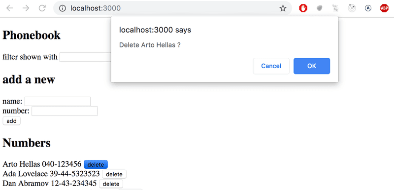
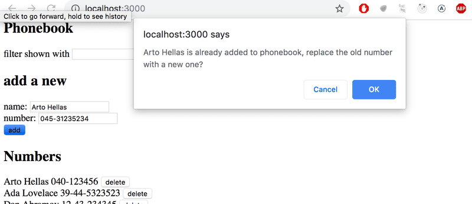

# Osa 2.4
## json-palvelin


## Tehtävät


### Tehtävä puhelinluettelo osa 6
#### Esivalmistelut:
1. Kopioi edellisen osan puhelinluettelo-projektin koko *App.jsx*-tiedoston sisältö tämän osan puhelinluettelo-kansion *App.jsx*-tiedostoon.
2. Jos siirsit edellisessä tehtävässä komponentteja omiin moduuleihinsa, kopioi myös nämä moduulit tämän osan projektiin.
    -Huom! kansiorakenteen tulee olla identtinen näiden kahden projektin välillä.

#### Tehtävä:
1. Lisää *puhelinluettelo*-kansioon uusi tiedosto *db.json* ja kopioi sinne tämä:
    ```json
    {
        "persons":[
            { 
                "name": "Arto Hellas", 
                "number": "040-123456",
                "id": "1"
            },
            { 
                "name": "Ada Lovelace", 
                "number": "39-44-5323523",
                "id": "2"
            },
            { 
                "name": "Dan Abramov", 
                "number": "12-43-234345",
                "id": "3"
            },
            { 
                "name": "Mary Poppendieck", 
                "number": "39-23-6423122",
                "id": "4"
            }
        ]
    }
    ``` 
2. Suorita komento **npm install json-server --save-dev**
3. Lisää *packages.json*-tiedoston *scripts*-lohkoon uusi rivi: **"server": "json-server -p 3001 db.json”**
4. Käynnistä nyt json-server komennolla **npm run server**.
5. Avaa toinen terminaali. Asenna ensin *axios*-kirjasto komennolla **npm i axios**. Asenna myös muut riippuvuudet komennolla **npm i**. Käynnistä sitten React-sovellus.
6. Muuta puhelinluettelo-sovellusta niin, että sovelluksej alkutila haetaan JSON-palvelimelta
    - Käytä axios.get-metodia ja useEffect-funktiota
7. Testaa, että sovellus toimii ja varmista, ettei konsolissa näy virheitä. Palauta tehtävä tekemällä commit. Lisää commit-viestiin tehtävän numero, eli

### Tehtävä puhelinleuttelo osa 7
1. Muuta *addPerson*-funktiota siten, että uusi henkilö lisätään myös palvelimelle.
    1. Käytä **axios.post**-metodia
    2. Päivitä komponentin tilat (persons ja newPerson) then-lohkon sisällä.
        - Älä lisää *personObject*-olioon id-kenttää. Palvelin lisää sen automaattisesti.
        - Kun päivität persons-tilaa, käytä response-olion data-kentästä löytyvää oliota äläkä tekemääsi *personObject*-oliota. 
        - Haluamme käyttää palvelimen palauttamaa oliota, koska se voi poiketa frontEndissä tehdystä oliosta. Meidän tapauksessa ainoastaan palvelimen palauttamassa oliossa on id.
2. Testaa, että sovellus toimii ja varmista, ettei konsolissa näy virheitä. Palauta tehtävä tekemällä commit. Lisää commit-viestiin tehtävän numero, eli

### Tehtävä puhelinluettelo osa 8
Haluamme nyt siirtää palvelimen kanssa kommunikoinnin erilliseen moduuliin.
1. Lisää puhelinluettelon *src*-kansioon uusi kansio *services*
2. Lisää *services*-kansioon uusi tiedosto *persons.js* ja kopioi sinne tämä:
    ```js
    import axios from 'axios'
        const baseUrl = 'http://localhost:3001/blogs'

        const getAll = () => {
        return axios.get(baseUrl)
        }

        // Lisää tähän funktio "create", joka saa parametrina person-olion ja tekee HTTP POST-pyynnön

        export default { 
        getAll: getAll
        }
    ```
3. Lisää *persons.js*-tiedostoon merkittyyn kohtaan funktio, jolla voidaan lisätä uusi henkilö palvelimelle
    - Muista exportata tekemäsi funktio!
4. Muuta *App.jsx* siten, että et käytä axiosia suoraan tästä tiedostosta vaan käytät *persons.js*-tiedoston funktioita.
    1. Importtaa tekemäsi *persons.js* muuttujaan *personService*
    2. Muuta kaikki viittaukset axiosiin käyttämään *personService*n funktioita. Muista edelleen käyttää *then*-rakennetta!
5. Testaa, että sovellus toimii ja varmista, ettei konsolissa näy virheitä. Palauta tehtävä tekemällä commit. Lisää commit-viestiin tehtävän numero, eli

### Tehtävä puhelinluettelo osa 9
Tässä tehtävässä lisätään mahdollisuus poistaa tietoja puhelinluettelosta. Sovelluksen pitää käyttää [window.confirm](https://developer.mozilla.org/en-US/docs/Web/API/Window/confirm)-metodia. Tehtävän jälkeen sovellus näyttää tältä:
     

1. Lisää *personService*en (eli *persons.js*-tiedostoon) uusi funktio, jolla voidaan poistaa tietoja puhelinluettelosta.
    - Funktio ottaa parametrina id:n ja tekee HTTP DELETE-pyynnön osoitteeseen **`${baseUrl}/${id}`**
    - Muista exportata funktio!
    - HUOM et voi antaa funktion nimeksi "delete", koska se on jo varattu johonkin muuhun JavaScriptissa. Anna funktion nimeksi esim. *remove*
2. Lisää *delete*-nappi (eli button-elementti) jokaisen renderöidyn henkilön tietojen viereen.
3. Lisää napille tapahtumankäsittelijä. Tapahtumankäsittelijä ottaa parametrina henkilön id:n. Se ensin varmistaa, haluaako käyttäjä poistaa henkilön (käytä window.confirm -metodia). Jos käyttäjä vastaa myöntävästi, se kutsuu *personService*n *remove*-funktiota, ja poistaa id:n mukaisen henkilön *persons*-tilasta, jos pyyntö on onnistunut.
4. Testaa, että sovellus toimii ja varmista, ettei konsolissa näy virheitä. Palauta tehtävä tekemällä commit. Lisää commit-viestiin tehtävän numero, eli


### Tehtävä puhelinluettelo osa 10
Tässä tehtävässä lisätään mahdollisuus muuttaa puhelinluettelosta löytyvän henkilön tietoja. Jos käyttäjä yrittää lisätä tietoja henkilölle, joka on jo puhelinluettelossa, näytetään window.confirm-metodilla tehty ilmoitus. Käyttäjä voi valita, haluaako hän muuttaa henkilön tietoja vai peruuttaa pyynnön.
    

1. 