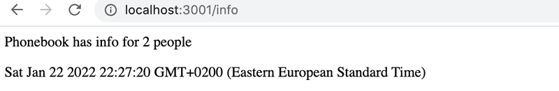
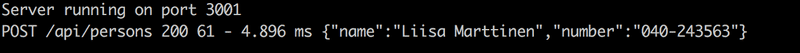

# Osa 3.1
## Palvelin expressilla
Tässä osassa tutustutaan palvelimen ohjelmointiin express-kirjastolla. Osan kansiosta löytyy esimerkkisovellus kansiosta *esimerkkibackend*. Pystyt käynnistämään sovelluksen suorittamalla kansiossa ensin komennon **npm i** ja sitten **npm run dev**. Kokeile lähettää pyyntöjä esimerkiksi REST clientilla. Voit myös kokeilla muuttaa koodia ja katsoa, mitä tapahtuu. Varmista, että tiedät seuraavat käsitteet sekä miten niitä käytetään: *route*, *url-parametri*, *HTTP-pyyntö*, *statuskoodi*, *json*, *request ja response -oliot*


## Tehtävät
### Esivalmistelut
1. Navigoi terminaalissa tästä osasta löytyvään kansioon *puhelinluetteloBackend*
2. Suorita komento **npm init**
    - Voit vastata kaikkiin kysymyksiin oletusvastauksen. Eli paina enteriä niin kauan, että kysymykset loppuvat.
3. Kansioon on nyt ilmestynyt *package.json*-tiedosto, lisää *scripts*-lohkoon rivit
    - "start": "node index.js",
    - "dev": "node --watch index.js",
4. Lisää kansioon uusi tiedosto *index.js* ja kopioi sinne tämä:
    ```js
    const express = require('express')
    const app = express()

    let persons = [
        {
            id: "1",
            name: "Ada Lovelace",
            number: "39-44-5232335"
        },
        {
            id: "2",
            name: "Dan Abramov",
            number: "39-44-5232525"
        },
        {
            id: "3",
            name: "Mary Poppendieck",
            number: "39-44-5232521"
        },
    ]


    const PORT = 3001
    app.listen(PORT, () => {
    console.log(`Server running on port ${PORT}`)
    })
    ```
5. Asenna express komennolla **npm i express**
6. Käynnistä palvelin komennolla **npm run dev**
    - Jos konsoliin tulee virheviesti, tarkista, että olet sammuttanut edellisen osan JSON-palvelimen ja yritä uudelleen.
    

### Tehtävä 3.1 puhelinluettelon backend osa 1

1. Lisää *index.js*-tiedostoon route, joka käsittelee osoitteeseen [http://localhost:3001/api/persons](http://localhost:3001/api/persons) tulevat HTTP GET-pyynnöt ja palauttaa json-muodossa *persons*-taulukon
2. Tarkista, että sovellus toimii avaamalla selaimessa osoitteen [http://localhost:3001/api/persons](http://localhost:3001/api/persons)
    - Selaimessa pitäisi näkyä *persons*-taulukon sisältö
3. Palauta tehtävä tekemällä commit. Lisää commit-viestiin tehtävän numero, eli 3.1

### Tehtävä 3.2 puhelinluettelon backend osa 2
1. Lisää *index.js*-tiedostoon route, joka käsittelee osoitteeseen [http://localhost:3001/info](http://localhost:3001/info) tulevat HTTP GET-pyynnöt.
2. Osoitteessa [http://localhost:3001/info](http://localhost:3001/info) tulee näkyä alla olevan kuvan mukainen sivu:
    
    - Sivun pitää näyttää sillä hetkellä puhelinluettelossa olevien henkilöiden määrä ja pyynnön tekohetki
    - Saat tämän hetkisen ajan **new Date()**-komennolla.
3. Tarkista, että sovellus toimii. Palauta tehtävä tekemällä commit. Lisää commit-viestiin tehtävän numero, eli 3.2

### Tehtävä 3.3 puhelinluettelon backend osa 3
1. Lisää sovellukseen route, jolla voi hakea yksittäisen puhelinluettelon henkilön tiedot. Route toimii url-parametrin avulla. Esim. henkilön, jonka id on 3 tiedot saa lähettämällä HTTP GET-pyynnön osoitteeseen [http://localhost:3001/api/persons/5](http://localhost:3001/api/persons/5)
2. Jos id:tä vastaava henkilöä ei toimi, sovelluksen pitää vastata statuskoodilla 404 not found
3. Tarkista, että sovellus toimii. Palauta tehtävä tekemällä commit. Lisää commit-viestiin tehtävän numero, eli 3.3

### Tehtävä 3.4 puhelinluettelon backend osa 4
1. Lisää sovellukseen route, jolla voi poistaa yksittäisen henkilön tiedot. Routen tulee jälleen toimia url-parametrin avulla. Esim. henkilön, jonka id on 3, voi poistaa lähettämällä HTTP DELETE-pyynnön osoitteeseen [http://localhost:3001/api/persons/5](http://localhost:3001/api/persons/5).
    - Sovellus voi vastata 204 no content -statuskoodilla onnistuneen poiston jälkeen
2. Testaa, että ominaisuus toimii käyttäen vs code REST clientia tai postmania
3. Palauta tehtävä tekemällä commit. Lisää commit-viestiin tehtävän numero, eli 3.4

### Tehtävä 3.5 puhelinluettelon backend osa 5
1. Lisää route, jolla voi litätä uusia tietoja puhelinluetteloon tekemällä HTTP POST -pyynnön osoitteeseen [http://localhost:3001/api/persons](http://localhost:3001/api/persons)
    - Uusille tiedoille pitää luoda uniikki id. Voit käyttää [Math.random](https://developer.mozilla.org/en-US/docs/Web/JavaScript/Reference/Global_Objects/Math/random) funktiota id:n luomiseen.
2. Lisää uuden tiedon lisäykseen virheenkäsittely. Pyynnön tulee epäonnistua, jos nimi tai numero puuttuu, tai lisättävä nimi on jo puhelinluettelossa:
    - Jos nimi tai numero puuttuu, sovellus vastaa statuskoodilla 400 ja palauttaa virheviestin 'name or number missing'
    - Jos nimi löytyy jo puhelinluettelosta, sovellus vastaa statuskoodilla 400 ja palauttaa virheviestin 'name already exists'
3. Testaa, että ominaisuus toimii käyttäen vs code REST clientia tai postmania
4. Palauta tehtävä tekemällä commit. Lisää commit-viestiin tehtävän numero, eli 3.5

### Tehtävä 3.6 puhelinluettelon backend osa 6
Lisätään sovellukseen middware [morgan](https://github.com/expressjs/morgan), joka voi huolehtia sovelluksen loggauksesta:

1. Keskeytä palvelimen suoritus (ctrl+C) ja asenna morgan komennolla **npm i morgan**. Käynnistä sen jälkeen palvelin uudelleen komennolla **npm run dev**
2. Ota morgan käyttöön *index.js*-tiedostossa ensin importtaamalla se, ja sitten lisäämällä komento **app.use(morgan('tiny'))** sopivaan kohtaan tiedostossa
    - Vinkki: tämä middleware pitää ottaa käyttöön ennen routeja
3. Kokeile tehdä muutamia HTTP-pyyntöjä esim. REST clientilla tai avaamalla palvelimen osoitteita selaimessa. Terminaalissa pitäisi näkyä loggaukset kaikista tekemistäsi pyynnöistä.
4. Palauta tehtävä tekemällä commit. Lisää commit-viestiin tehtävän numero, eli 3.6

### Bonustehtävä 3.7 puhelinluettelo backend osa 7
1. Tutustu [morganiin](https://github.com/expressjs/morgan) tarkemmin ja configuroi se siten, että se näyttää HTTP POST-pyyntöjen mukana tulevan datan alla olevan kuvan mukaisesti:
    
    - Saatat tarvita näitä: [creating new tokens](https://github.com/expressjs/morgan#creating-new-tokens), [JSON.stringify](https://developer.mozilla.org/en-US/docs/Web/JavaScript/Reference/Global_Objects/JSON/stringify)
    -Huom tämä tehtävä voi olla aika hankala, ei kannata käyttää tämän yrittämiseen liikaa aikaa :)
2. Palauta tehtävä tekemällä commit. Lisää commit-viestiin tehtävän numero, eli 3.7