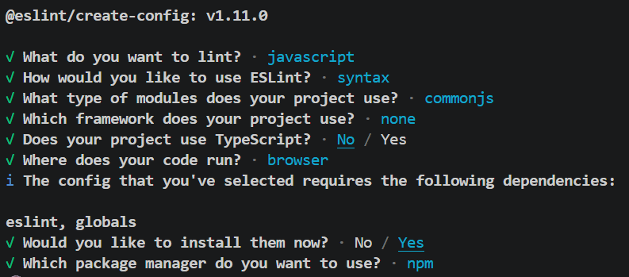

# Osa 3.3
## Palvelimen yhdistäminen tietokantaan
Tässä osassa palataan varsinaiseen palvelimen ohjelmointiin. Nyt aiemman osan palvelin yhdistetään tietokantaan, jolloin sovellus alkaa muistuttamaan todellisia palvelimia. Samalla tutustutaan myös vähän lisää middlewareihin, ja tehdään ensimmäiset omat middlewaret.

Osan kansiosta löytyy kaksi esimerkkisovellusta. Ensimmäinen esimerkki on kansiossa *esimerkkiBackendTietokannalla* ja se vastaa tehtäviä 3.12-3.18. Varsinainen sovelluskoodi on *index.js*-tiedostossa. Sovelluksen testausta varten *request*-kansiosta löytyy valmiita rest-tiedostoja, joilla voit lisätä, muokata ja poistaa muistiinpanoja palvelimelta. Tutustu esimerkkisovellukseen ja testaa sen ominaisuuksia. Varmista, että ymmärrät seuraavat asiat: *tietokantamalli*, *sequalizen metodit init ja sync*, *sequelizen metodit findAll, findByPk, create, destroy, update*, *virheidenkäsittely middleware*.

Toinen esimerkkisovellus on kansiossa *esimerkkiBackendTietokannalla2* ja se vastaa loppuja tämän osan tehtäviä. Kannattaa ensin tehdä tehtävät 3.12-3.16 ja sitten vasta tutustua toiseen esimerkkisovellukseen. Tässä esimerkissä tietokantaan liittyvät määrittelyt on siirretty omaan moduuliin, joka löytyy *models*-kansiosta. Myös itse määritellyt middlewaret on siirretyy omaan tiedostoonsa *utils*-kansioon. *middleware.js*-tiedoston koodi on kopioitu suoraan *index.js*-tiedostosta. *notes.js*-tiedostoon on tehty pieni lisäys tietokantamallin validaatioihin. Tutustu mallinmäärittelyyn tarkkaan. Toiseen esimerkkiin on lisätty myös EsLint-koodin tarkistus. Tutustu lintterin toimintaan ja eslint-konfiguraatioon, joka löytyy tiedostosta *eslint.config.mjs*

### Esimerkkisovelluksen käynnistys
1. Varmista, että tietokantasi on käynnissä
2. Lisää kansioon *esimerkkiBackendTietokannalla* uusi *.env*-tiedosto, johon on määritelty tietokantasi osoite (voit taas kopioida aiemmista tehtävistä)
2. Navigoi terminaalissa esimerkin kansion ja suorita komento **npm i**
3. Sovellus käynnistyy nyt komennolla **npm run dev**
4. Toista samat askeleet myös *esimerkkiBackendTietokannalla2*-sovelluksen kanssa.
5. Voit kokeilla eslinttiä komennolla **npm run lint**. *middleware.js*-tiedostoon on tarkoituksella jätetty virheitä, jotta näet millaisia virheviestejä lintteri tuottaa. Voit halutessasi korjata virheet.

## Tehtävät
Tämän osan tehtävissä jatketaan puhelinluetteloBackendiä. Aiempaa backend-sovellusta muutetaan niin, että kaikki data on tietokannassa kovakoodatun taulukon sijaan. Kun teet tehtäviä, **älä** poista *let persons*-taulukkoa ennen kuin kaikki tehtävät on tehty. Sovelluksen pitää toimia jokaisen tehtävän jälkeen.

### Esivalmistelut
1. Kopioi osan 3.1 *puhelinluetteloBackend* tämän osan kansioon
2. Poista kopioimastasi kansiosta *node_modules*-kansio
3. Navigoi terminaalissa kopioimaasi kansioon ja suorita komennot **npm i** ja **npm install express dotenv pg sequelize**
4. Lisää kopioimaasi kansioon *.env*-tiedosto, johon lisäät tietokannan osoitteen.
    - Voit kopioida *.env*-tiedoston edellisen osan tehtävästä.
5. Lisää kopioimasi kansion *.gitignore*-tiedostoon uusi rivi **.env**
    - Tämä varmistaa, ettet vahingossa lisää *.env*-tiedostoa gitiin
6. Kopioi sitten myös osan 3.1 frontEnd-sovellus tämän osan kansioon, poista *node_modules*-kansio ja suorita komento **npm i** oikeassa kansiosijainnissa.
7. Molemmat sovellukset käynnistyvät komennolla **npm run dev**

### Tehtävä 3.12 puhelinluetteloBackend osa 9
1. Lisää backend-sovelluksen alkuun tarvittvat importit, jotta sovellus voi yhdistää tietokantaan
    - Tarvitset dotenv-kirjastoa sekä sequelizeria
    - Voit katsoa mallia esimerkkisovelluksesta
2. Lisää backend-sovellukseen koodi, joka yhdistää sovelluksen tietokantaan
    - Sinun pitää luoda uusi sequelize-instanssi
    - Voit jälleen katsoa mallia esimerkkisovelluksesta
3. Lisää backend-sovellukseen *Person*-tietokantamallin määrittely. Mallin pitää sisältää seuraavat kentät:
    - id (uniikki, kasvaa kun lisätään uusia rivejä)
    - name (merkkijono, joka ei voi olla tyhjä)
    - phonenumber (merkkijono, joka ei voi olla tyhjä)
4. Lisää tietokantamallin määrittelyn perään koodirivi, joka varmistaa sovelluksen toiminnan, vaikka tietokannassa ei vielä olisi *Persons*-taulua
    -Vinkki: käytä sync()-metodia
5. Muuta kaikki henkilöt hakevaa routea siten, että tiedot haetaan tietokannasta. Tarkista toimivuus esimerkiksi avaamalla routeen viittaava osoite selaimessa.
    - Tietokannasta pitäisi löytyä edellisessä osassa lisätyt henkilöt, jos et poistanut niitä.
6. Käynnistä myös puhelinluettelo frontEnd-sovellus ja varmista, että sovellus toimii. Myös fronEndin pitäisi hakea alkutiedot tietokannasta.
7. Palauta tehtävä tekemällä commit. Lisää commit-viestiin tehtävän numero, eli 3.12

### Tehtävä 3.13 puhelinluetteloBackend osa 10
1. Muuta numerotietojen lisäyksestä huolehtivaa routea siten, että uudet numerotiedot lisätään tietokantaan.
2. Varmista, että tietojen lisäys toimii frontEndissä.
3. Palauta tehtävä tekemällä commit. Lisää commit-viestiin tehtävän numero, eli 3.13

### Tehtävä 3.14 puhelinluetteloBackend osa 11
1. Muuta numerotietojen poistoon tarkoitettua routea siten, että poisto tehdään tietokantaan.
2. Tarkista, että poistaminen toimii frontEndissä muutosten jälkeen.
3. Palauta tehtävä tekemällä commit. Lisää commit-viestiin tehtävän numero, eli 3.14

### Tehtävä 3.15 puhelinluetteloBackend osa 12
1. Lisää backendiin oma middleware, joka käsittelee pyynnöt osoitteisiin, joille ei ole määritelty routeja. Anna middlewaren nimeksi *unknownEndpoint*
    - Voit katsoa mallia esimerkkisovelluksesta
2. Testaa, että *unknownEndpoint*-middleware toimii yrittämällä avata selaimessa osoite, jolle ei ole määritelty routea
    - Esim. [http://localhost:3001/api/tyhj%C3%A4](http://localhost:3001/api/tyhj%C3%A4)
    - Selaimessa pitäisi näkyä **{"error":"unknown endpoint"}**
3. Lisää oma middleware, joka käsittelee virhetilanteet *CastError* ja *SequelizeValidationError*. Anna middlewaren nimeksi *errorHandler*
    - Voit katsoa mallia esimerkkisovelluksesta
4. Testaa errorHandleria rest-clientin avulla: 
    1. yritä ensin tehdä HTTP DELETE-pyyntö siten, että laitat osoitteeseen id:n paikalle jonkin merkkijonon. Tämän pitäisi aiheuttaa *CastError*-tyyppinen virhe
    2. yritä tehdä HTTP POST-pyyntö, josta puuttuu puhelinnumero. Tämän pitäisi aiheuttaa *SequelizeValidationError*-tyyppinen virhe.
5. Palauta tehtävä tekemällä commit. Lisää commit-viestiin tehtävän numero, eli 3.14

### Tehtävä 3.16 puhelinluetteloBackend osa 13
1. Muuta routea, joka hakee yksittäisen numerotiedon, siten, että se hakee tiedon tietokannasta.
2. Voit nyt poistaa *let Persons*-muuttujan määrittelyn kokonaan.
3. Testaa routen toiminta selaimella tai REST clientilla
4. Palauta tehtävä tekemällä commit. Lisää commit-viestiin tehtävän numero, eli 3.16

**Huom pakolliset tehtävät jatkuvat bonustehtävien jälkeen!**

### Bonustehtävä 3.17 puhelinluetteloBackend osa 14
1. Muuta *HTTP GET api/persons/info* -routea siten, että numerotietojen kokonaismäärä haetaan tietokannasta
2. Testaa, että ominaisuus toimii ja palauta tehtävä tekemällä commit. Lisää commit-viestiin tehtävän numero, eli 3.17

### Bonustehtävä 3.18 puhelinluetteloBackend osa 15
1. Lisää backendiin route, joka käsittelee *HTTP PUT api/persons/:id* polkuun tulevat pyynnöt. Routen tulee päivittää osoitteen id-parametrin mukainen numerotieto pyynnön mukana tulevan olion mukaisesti.
    - Route siis saa response.body-kentässä olion, joka sisältää uuden numerotieto-olion
2. Testaa ensin REST clientilla ja sitten frontEnd-sovelluksella, että ominaisuus toimii.
    - frontEndin pitäisi toimia siten, että jos käyttäjä yrittää lisätä uuden numerotiedon henkilölle, joka löytyy jo tietokannasta, käyttäjä voi päivittää kyseiselle henkilölle uuden numeron. Saatat joutua tekemään muutoksia myös frontEnd-sovellukseen.
3. Palauta tehtävä tekemällä commit. Lisää commit-viestiin tehtävän numero, eli 3.18

### Tehtävä 3.19 puhelinluetteloBackend osa 16
1. Refaktoroi backEnd-sovellusta siten, että siirrät tietokantamääritellyt omaan moduulii:
    1. Lisää sovelluksen kansioon uusi kansio *models*
    2. Lisää tekemääsi kansioon uusi tiedosto *person.js*
    3. Siirrä tietokantamäärittelyihin liittyvä koodi *index.js*-tiedostosta uuteen *person.js*-tiedostoon
    4. Lisää tarvittavat exportit ja importit
    - Voit katsoa mallia esimerkkisovelluksesta
2. Tarkista, että sovellus toimii edelleen.
3. Siirrä myös middlewaret *unknownEndpoint* ja *errorHandler* omaan moduuliin. Tarkista, että ne toimivat edelleen.
4. Palauta tehtävä tekemällä commit. Lisää commit-viestiin tehtävän numero, eli 3.19

### Tehtävä 3.20 puhelinluetteloBackend osa 17
1. Lisää puhelinluetteloon lisättäville tiedoille validaatio käyttäen sequelizer-kirjaston validaatio-ominaisuutta: lisättävien henkilöiden nimen merkkien määrä pitää olla minimissään 3 ja maksimissaan 40.
2. Tarkista, että validaatio toimii yrittämällä lisätä uusia numerotietoja, jotka rikkovat validaatio sääntöä.
3. Lisää validaatiolle myös sopiva viesti. Esimerkiksi *"The length of the name must be between 3 and 40 characters"*
4. Testaa ominaisuus frontEndin kautta. FrontEndin pitäisi näyttää validaation virheilmoitus aiemmin tehdyllä **Notification**-komponentilla.
5. Palauta tehtävä tekemällä commit. Lisää commit-viestiin tehtävän numero, eli 3.20

### Bonustehtävä 3.21 puhelinluetteloBackend osa 18
1. Lisää myös puhelinnumeroille validaatio. Puhelinnumeron täytyy olla:
    - vähintään 8 merkkiä pitkä
    -  koostua kahdesta väliviivalla erotetusta osasta joissa ensimmäisessä osassa on 2 tai 3 numeroa ja toisessa osassa riittävä määrä numeroita
        * esim. 09-1234556 ja 040-22334455 ovat oikeassa muodossa
        * esim. 1234556, 1-22334455 ja 10-22-334455 eivät ole kelvollisia
- Toteuta validaatio custom validaationa. Dokumentaatio sequelizerin validointiin löytyy [täältä](https://sequelize.org/docs/v6/core-concepts/validations-and-constraints/)
2. Testaa, että validaatio toimii oikein
3. Palauta tehtävä tekemällä commit. Lisää commit-viestiin tehtävän numero, eli 3.21

### Tehtävä 3.22 puhelinluetteloBackend osa 19
Tässä tehtävässä sovellukseen lisätään *lintteri*
1. Sammuta backend sovellus ja asenna ESLint komennolla **npm install eslint @eslint/js --save-dev**
2. Muodosta ESLint-konfiguraatio suorittamalla komento **npx eslint --init**. Vastaa kysymyksiin alla olevan kuvan mukaisesti:
     
3. Suorita vielä komento **npm install --save-dev @stylistic/eslint-plugin**
4. Kansiosta pitäisi nyt löytyä tiedosto *eslint.config.mjs*. Korvaa sen sisältö alla olevalla koodilla:
    ```js
    import globals from 'globals'
    import js from '@eslint/js'
    import stylisticJs from '@stylistic/eslint-plugin'

    export default [
        js.configs.recommended,
        {
            files: ['**/*.js'],
            languageOptions: {
                sourceType: 'commonjs',
                globals: { ...globals.node },
                ecmaVersion: 'latest',
            },
            plugins: { 
                '@stylistic/js': stylisticJs,
            },
            rules: { 
                '@stylistic/js/indent': ['error', 2],
                '@stylistic/js/linebreak-style': ['error', 'unix'],
                '@stylistic/js/quotes': ['error', 'single'],
                '@stylistic/js/semi': ['error', 'never'],
                eqeqeq: 'error',
                'no-trailing-spaces': 'error',
                'object-curly-spacing': ['error', 'always'],
                'arrow-spacing': ['error', { before: true, after: true }],
                'no-console': 'off',
            },
        },
    ]
    ```
5. Lisää *package.json*-tiedoston scripts-lohkoon uusi rivi **"lint": "eslint ."**
6. Voit nyt ajaa lintterin komennolla **npm run lint**. Korjaa kaikki kohdat, joista lintteri valittaa.
    - Voit kokeilla myös komentoa **npm run lint -- --fix**, joka korjaa suurimman osan virheistä.
    - Virheitä on todennäköisesti paljon, koska vs code laittaa uusien tiedostojen rivin "end of line" valinnaksi oletuksena CRLF mutta haluamme käyttää LF:ää, sillä CRLF ei toimi kaikilla käyttöjärjestelmillä. Avoimen tiedoston "end of line"-merkin voi vauhtaa vs coden alareunasta. Voit myös googlata, miten saat oletus rivin lopetus merkin vaihdettua.
    - Myös sinun sisennysten koko voi olla oletuksellisesti eri, kuin ylläoleva lintter konfiguraatio olettaa. Tämä voi olla hankala korjata olemassa olevista tiedostoista, eli pyydä tarvittaessa apua!
7. Kun olet korjannut koodin, palauta tehtävä tekemällä commit. Lisää commit-viestiin tehtävän numero, eli 3.22

### Bonustehtävä 3.23 lintteri
Tätä tehtävää ei palauteta.
1. Asenna vs codeen *eslint* -extension. Tämä lisäosa merkkaa linttausvirheet koodissa punaisella, jotta huomaat ne heti.
2. Tarkista vs coden autoformatterin asetukset, ja muuta ne sopiviksi. Kannattaa asettaa formattointi tallennuksen yhteydessä päälle.
    - Asetukset löytyvät File -> preferences -> settings
    - Asetuksissa kannattaa käyttää haku ominaisuutta, esim format sanalla löytyy autoformatteriin liittyvät asetukset, indentation löytyy sisennyksien asetukset jne.